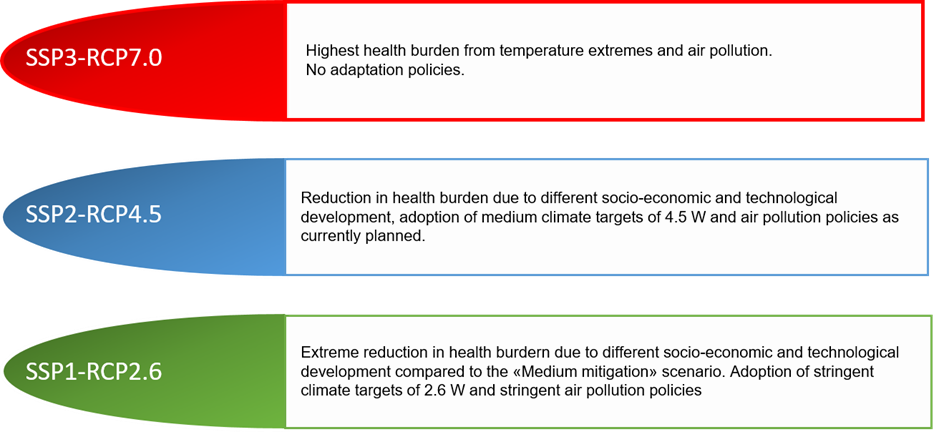

# Health impact projections under demographic, climate change and adaptation scenarios.

"A changing climate means that negative exposure to heat waves and wildfires will increase, even in Europe. Acts of adaptation and mitigation can make people less vulnerable and communities more resilient to those changes. The aim of WP4 is to give a cost and a weight, in terms of health impacts, to different potential future adaptation and mitigation scenarios."

More from deliverable Word doc?

## Data

This app maps projections for 854 cities, each with over 50,000 inhabitants in 30 countries across Europe, and covers five age groups: 20-44, 45-64, 65-74, 75-84 and 85 and above. The historical period "Hist."is defined as 1990-2019 and the projections period is defined from 2020-2099.

## Excess mortality computation (Impact Measures)

What is an exposure response function (explain above so this can just be about results?)

#### Excess number of deaths:

Once city and age-specific exposure response functions are defined, they are used to compute the number of deaths that can be attributed to non-optimal temperatures.These temperature ranges, representing sub-optimal heat and cold, are defined per-city and relative to each city's minimum-mortality-temperature.

#### Excess fraction of deaths:

The number of excess deaths is divided by the total population (of each city?) to obtain an excess death rate. This value represents ...

#### Excess mortality rate:

/100.000 person-years

#### Standardised death rates

We have not included stdrate, standardised mortality rate, other than in the All Data tab.

## Scenarios (Filtering Variables)

#### Shared Socioeconomic Pathways and Representative Concentration Pathways.

[SSPs](https://en.wikipedia.org/wiki/Shared_Socioeconomic_Pathways) and [RCPs](https://en.wikipedia.org/wiki/Representative_Concentration_Pathway) are future global scenarios of pollutant emission and concentration levels respectively, projected up to the year 2100. These projections can be combined with other scenarios such as different policies to estimate social, economic and health impacts.

In this analysis, three SSP-RCP combinations represent a baseline of demographic, climate and adaptation change.

{width="500"}

#### Sub-scenario:

Text

#### Temperature impact:

Text

## Get in touch

In you have any queries about the [EXHAUSTION](https://www.exhaustion.eu/) project please get in touch at [EXHAUSTIONManagement\@cicero.oslo.no](mailto:EXHAUSTIONManagement@cicero.oslo.no) and if you would like to know more about the work done on the data mapped in this R shiny app reach out to ...

## This App

This web-app ...
